# Oracle Key Vault (OKV@ExaCC)

## Introduction
This workshop introduces the various features and functionality of Oracle Key Vault (OKV) to be used on Exadata Cloud at Customer (ExaCC). It gives the user an opportunity to learn how to configure this appliance to manage keys.

*Estimated Lab Time:* 60 minutes

*Version tested in this lab:* Oracle OKV 21.9 and DBEE 19.23

### Video Preview
Watch a preview of "*LiveLabs - Oracle Key Vault*" [](youtube:4VR1bbDpUIA)

### Objectives
- Upload the current and retired TDE master keys to Oracle Key Vault
- Migrate the encrypted database to OKV for centralized TDE key managemening automation tools of ExaCC
- Review and validate the MEKs on DB and OKV UI

### Prerequisites
This lab assumes you have:
<if type="brown">
- A Paid or LiveLabs Oracle Cloud account
- You have completed:
    - Lab: Prepare Setup (Paid Tenants only)
    - Lab: Environment Setup
    - Lab: Initialize Environment
</if>
<if type="green">
- An Oracle Cloud account
- You have completed:
    - Introduction Tasks
</if>

### Lab Timing (estimated)

<if type="brown">
| Task No. | Feature                                           | Approx. Time | Details                                                                    |
| -------- | ------------------------------------------------- | ------------ | -------------------------------------------------------------------------- |
| 1        | Setup OKV 29.10 from OCI Marketplace              | <10 minutes  |                                                                            |
| 2        | Create a OKV REST API Admin & Enable REST API     | <10 minutes  |                                                                            |
| 3        | Create an OCI Vault with a MEK & Secret           | 15 minutes   |                                                                            |
| 4        | Create an OCI dynamic group and policy for ExaCC  | 15 minutes   |                                                                            |
| 5        | Create a ExaCC Keystore to refer to OCI Vault     | 15 minutes   |                                                                            |
| 6        | Migrate Database TDE MEK from OMK to CML (OKV)    | 15 minutes   |                                                                            |
| 7        | Review OKV Vaults and Keys                        | 10 Minutes   |                                                                            |
| 8        | Reset the OKV Lab Config                          | <5 minutes   |                                                                            |
</if>
<if type="green">
| Task No. | Feature                                           | Approx. Time | Details                                                                    |
| -------- | ------------------------------------------------- | ------------ | -------------------------------------------------------------------------- |
| 2        | Create a OKV REST API Admin & Enable REST API     | <10 minutes  |                                                                            |
| 3        | Create an OCI Vault with a MEK & Secret           | 15 minutes   |                                                                            |
| 4        | Create an OCI dynamic group and policy for ExaCC  | 15 minutes   |                                                                            |
| 5        | Create a ExaCC Keystore to refer to OCI Vault     | 15 minutes   |                                                                            |
| 6        | Migrate Database TDE MEK from OMK to CML (OKV)    | 15 minutes   |                                                                            |
| 7        | Review OKV Vaults and Keys                        | 10 Minutes   |                                                                            |
| 8        | Reset the OKV Lab Config                          | <5 minutes   |                                                                            |
</if>

## Task 1: Setup OKV 29.10 from OCI Marketplace

To enable you to learn about Oracle Key Vault for TDE key management, you need an encrypted database deployed on ExaCC.
For this workshop we create an instance of OKV in the same compartment as the target VM cluster in a public or private subnet.
The assumption is that the network routing between the ExaCC subnet deployed on customer data center and the OKV subnet is configured properly using VPN or FastConnect.
    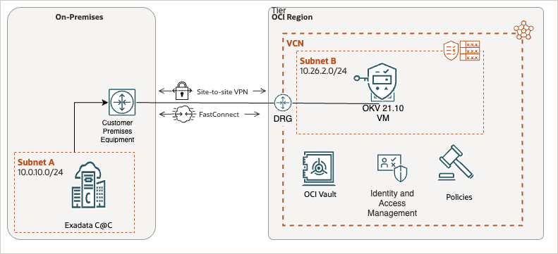

1. Install Oracle Key Vault 29.10 from OCI Marketplace at https://cloudmarketplace.oracle.com/marketplace/en_US/listing/89546838

    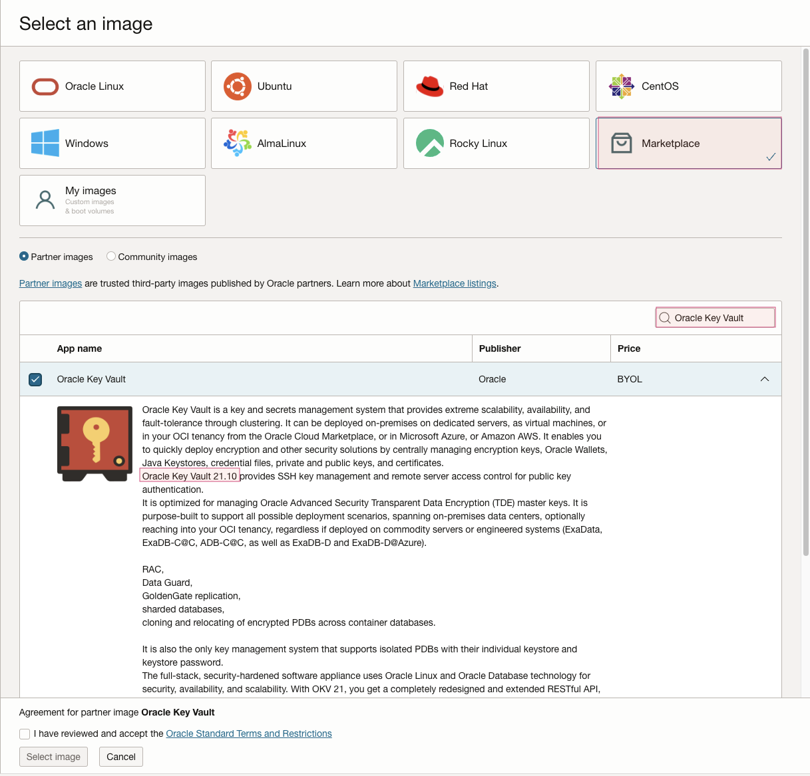


1.1 Connect to the OKV vm using ssh and set the the root password 

 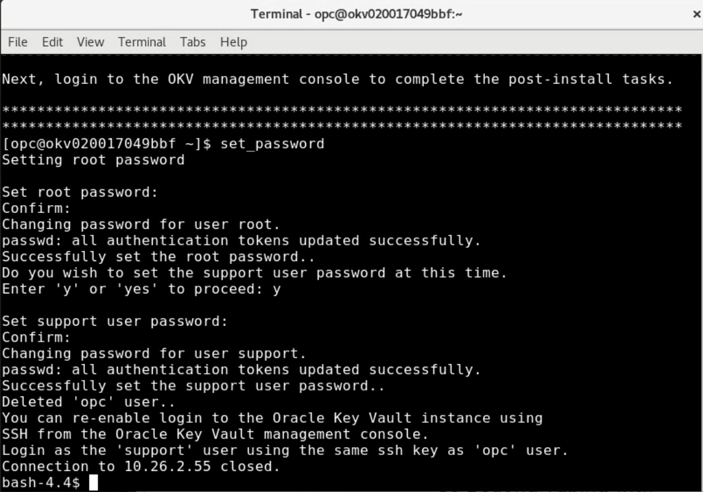

 1.2 Open the browser and access the OKV UI https://<IP-address of OKV> 
 You will be asked to reset the password and create a Key Administrator 

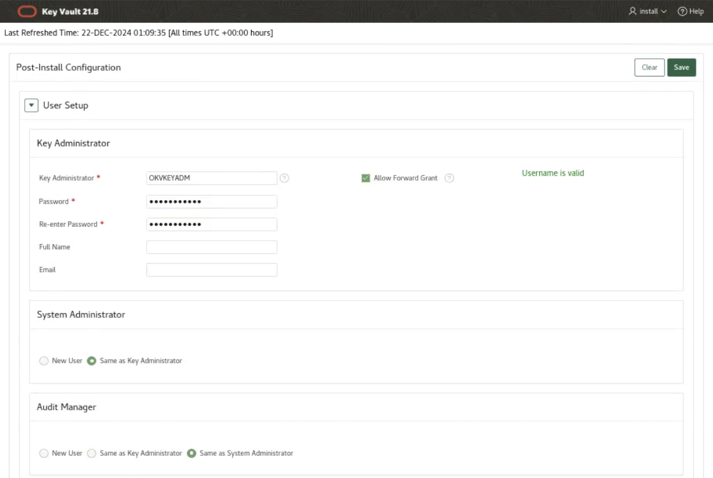

## Task 2: Create REST API Admin & Enable REST API 

2. Create REST API Admin & Enable REST API

2.1 Enable Rest API

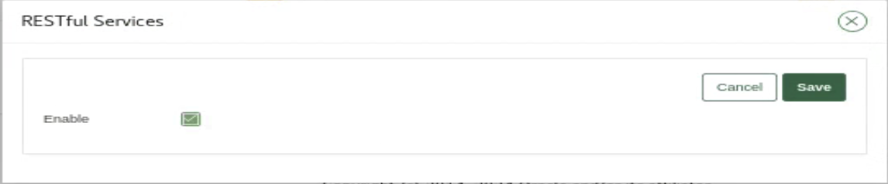

2.2 Verify REST API is enabled 

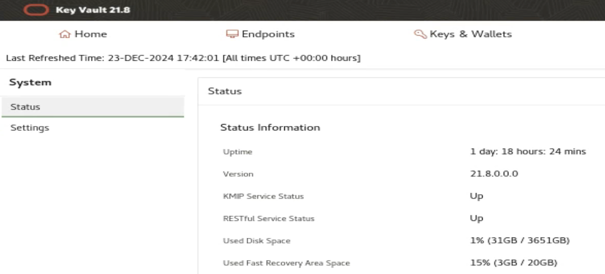

2.3 Allow RESTfull Services from IP Addresses 

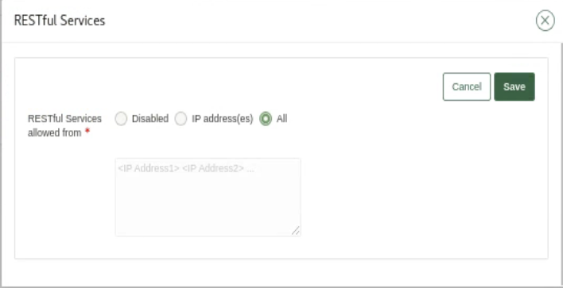

2.4 Create a REST API user and grant access permissions

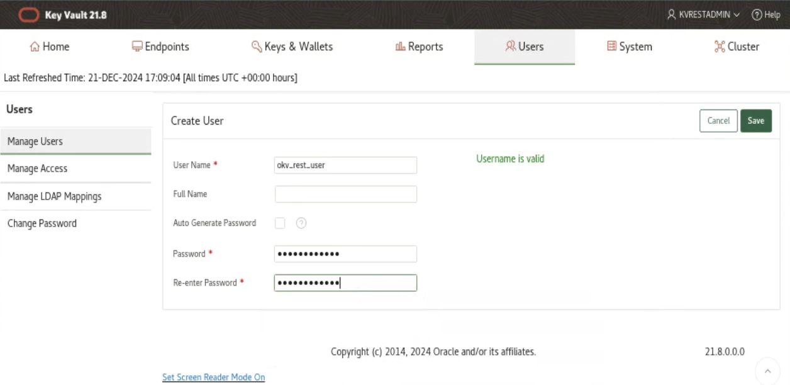

After the use is created at least two privileges "Create Endpoint" and "Create Endpoint Group" must be granted 

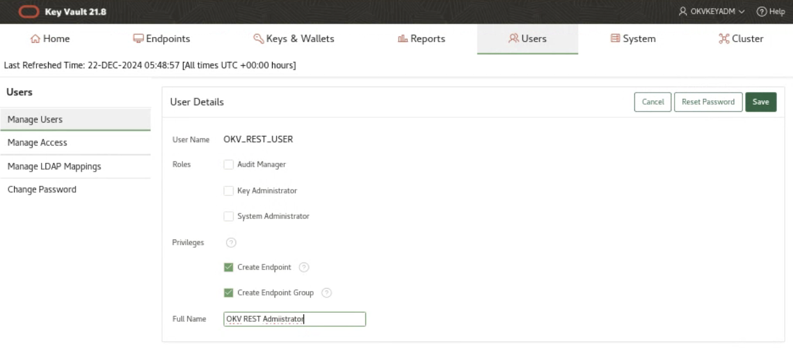

2.5 Log in to OKV as REST API user and and reset the initial password

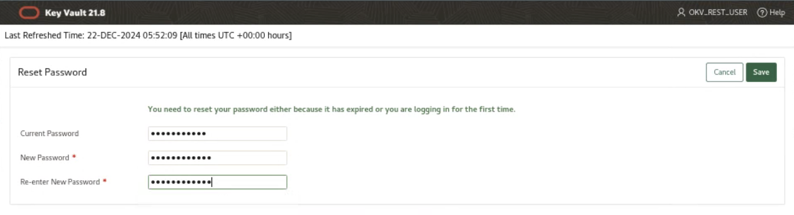

## Task 3: Create an OCI Vault with a MEK & Secret 

The password of the OKV REST ADMIN user needs to be stored in a secret within an OCI Vault 

3.1 Create a OCI Vault "OKV-vault" with a Master Encryption Key "OKVmgmt-key" 


3.2 Create a Secret "OKVowdo" in the OCI Vault 

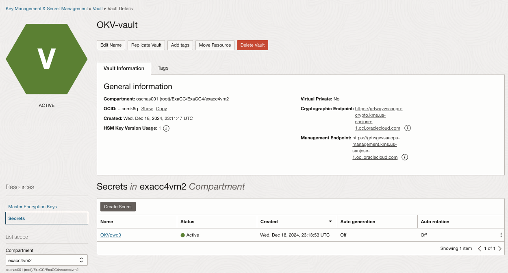

The Value of the Secret has to be the password of the OKV REST API User 

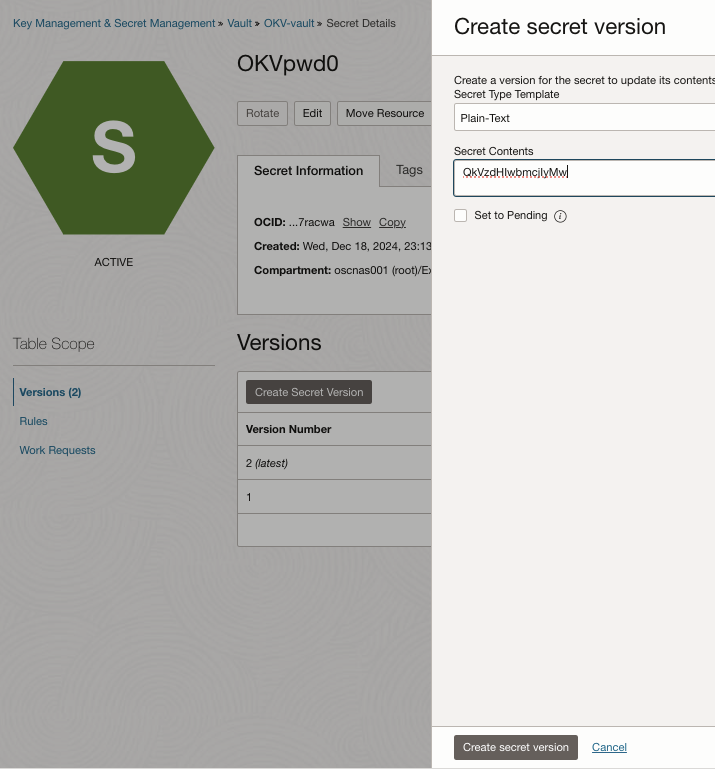


## Task 4: Create an OCI dynamic group and policy for ExaCC

A dynamic group "okv_dg" and related OCI IAM policy "okv-policy" needs to be created for Databases which need to connect to OKV

    ````
    <copy>okv_dg:</copy>
    <copy>resource.compartment.id = 'ocid1.compartment.oc1..aaaaaaaagss7aepalgfhz46gpjgnc6x2rj4fevunhojbk77a5nholhdlliaq'</copy>
    ````

    ````
    <copy>okv-policy
    Allow group okv_dg to use secret-family in compartment id ocid1.compartment.oc1..aaaaaaaagss7aepalgfhz46gpjgnc6x2rj4fevunhojbk77a5nholhdlliaq
    Allow group id ocid1.dynamicgroup.oc1..aaaaaaaayx6kuax6kfqp7uvdsz47rvoznewog5t7ttwzm6ukcr5qlsj52keq to use keystores in compartment id ocid1.compartment.oc1..aaaaaaaagss7aepalgfhz46gpjgnc6x2rj4fevunhojbk77a5nholhdlliaq
    Allow service database to read secret-family in compartment id ocid1.compartment.oc1..aaaaaaaagss7aepalgfhz46gpjgnc6x2rj4fevunhojbk77a5nholhdlliaq</copy>
    ````


## Task 5: Create a ExaCC Keystore to refer to OCI Vault


## Task 6: Migrate Database TDE MEK from OMK to CML (OKV)


Once you have prepared OKV, OCI dynamic group, IAM policy and ExaCC Keystore, you can migrate encrypted database from local, filed-based key management to centralized key management with Oracle Key Vault


4. When you're confortable with this concept, reset the secret configuration

    ````
    <copy>./okv_clean_endpoint_secret.sh</copy>
    ````

    

5. Congratulations, now you know how to use and manage a secret with OKV!


## Task 9: Generate New Non-extractable Key

This task will demonstrate how to create a non-extractable key, meaning a key that does not leave the Oracle Key Vault cluster. The key can be accessed by the approved endpoints but not stored by the endpoint client or the endpoint persistent cache.

1. Generate a new master encryption key for **pdb1** using the following command:

    ````
    <copy>./okv_online_pdb_rekey.sh pdb1</copy>
    ````

    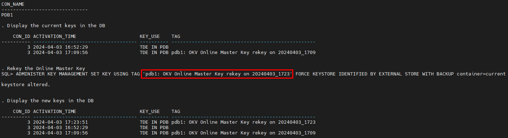

    **Note**: Take note of the tag information so you can identify this key in future steps.

2. Verify we have the new master encryption key in the virtual Wallet

    ````
    <copy>./okv_view_wallet_in_kv.sh</copy>
    ````

    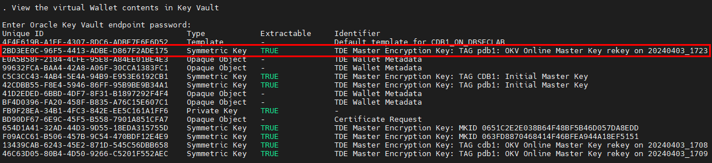

    **Note**:
    - Identify the MKID from the command in the previous step
    - Take note that the current extractable value is set to true, meaning it can be stored by the endpoint client software

3. Go back to the Oracle Key Vault console as KVRESTADMIN, and navigate to the "**Keys & Wallets**" tab

4. Click on the *CDB1* wallet

    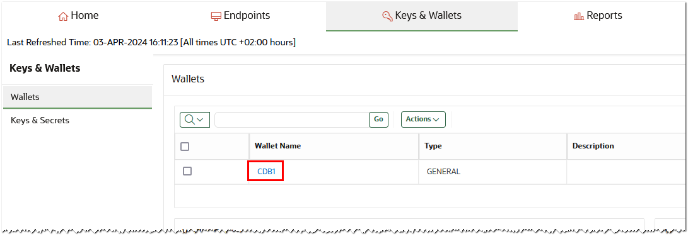

5. Find the key generated and click on it
 
    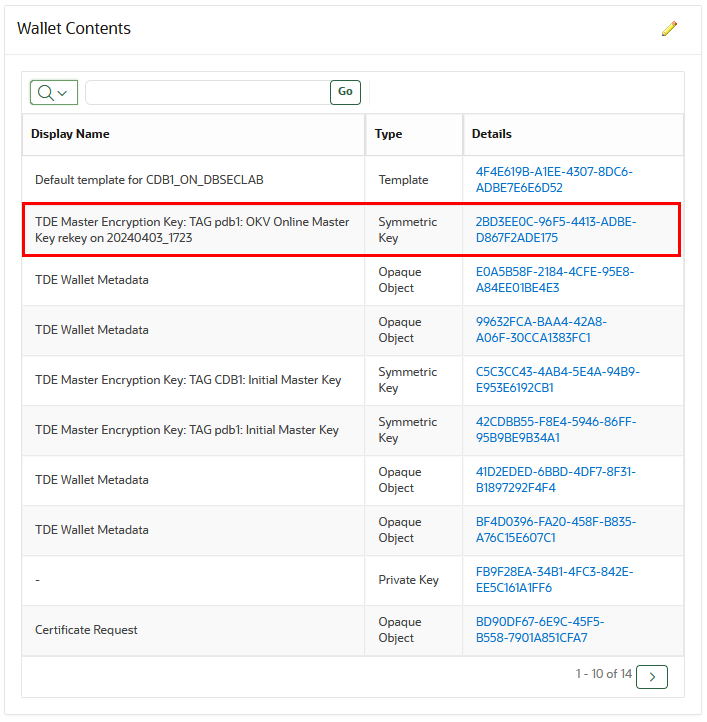

6. Scroll down to the "Advanced" section and mark it as non-extractable by changing the extractable status to *`False`* 

    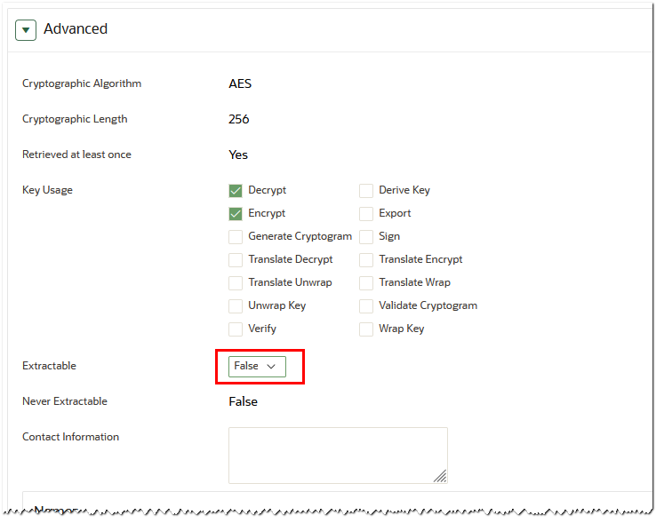

7. Then scroll up and click [**Save**]

8. Now, verify that the key is now marked as extractable (**FALSE**)

    ````
    <copy>./okv_view_wallet_in_kv.sh</copy>
    ````

    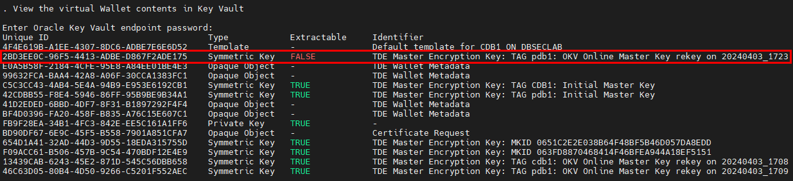

9. Attempt to download the OKV keys into a local wallet

    ````
    <copy>./okv_download_wallet.sh</copy>
    ````

    The password to enter is:

    ````
    <copy>Oracle123</copy>
    ````

    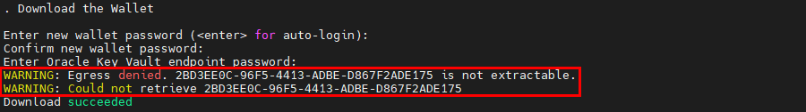
    
    **Note**: You can't download the OKV keys because a wallet cannot contain the non-extractable key

<if type="brown">
## Task 10: Reset the OKV Lab Config

1. Drop the Endpoint and Wallet created in OKV during this lab

    ````
    <copy>./okv_reset_config.sh</copy>
    ````

    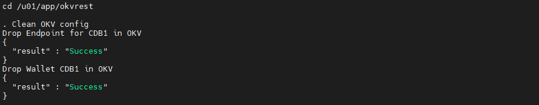

2. Reset OKV binaries

    ````
    <copy>
    rm -Rf $OKV_HOME
    rm -Rf $OKV_RESTHOME/!(*.tgz)
    ll $OKV_RESTHOME
    </copy>
    ````

    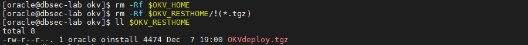

3. Drop the uploaded keys into Key Vault

    - Go back to the OKV Web Console as *`KVRESTADMIN`*

        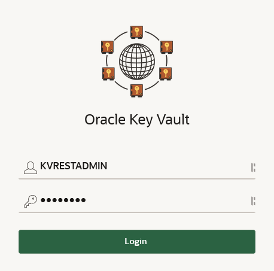

    - Go to the **Keys & Wallets** tab and select the sub-menu **Keys & Secrets**

        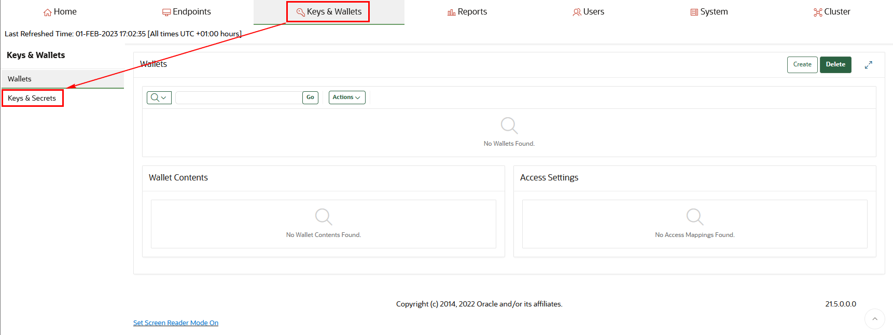

    - Select ALL items and click [**Delete**]

        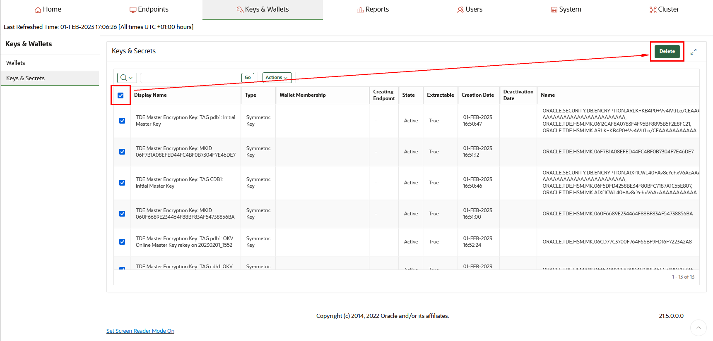

    - Confirm deletion by clicking [**OK**]

        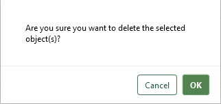

    - Now, your uploaded keys have been removed

        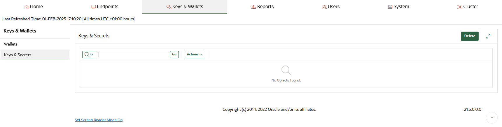

4. Restore the DB like before-TDE

    - Go to the TDE scripts directory

        ````
        <copy>cd $DBSEC_LABS/tde</copy>
        ````

    - First, execute this script to restore the pfile

        ````
        <copy>./tde_restore_init_parameters.sh</copy>
        ````

        


    - Second, restore the database (this may take some time)

        ````
        <copy>./tde_restore_db.sh</copy>
        ````

        

    - Third, delete the associated Oracle Wallet files

        ````
        <copy>./tde_delete_wallet_files.sh</copy>
        ````

        

    - Fourth, start the container and pluggable databases

        ````
        <copy>./tde_start_db.sh</copy>
        ````

        

        **Note**: This should have restored your database to it's pre-TDE state!

    - Finally, verify the initialization parameters don't say anything about TDE

        ````
        <copy>./tde_check_init_params.sh</copy>
        ````

        

    - Go back to OKV scripts directory and view the Oracle Wallet contents on the **database**

        ````
        <copy>$DBSEC_LABS/okv/okv_view_wallet_in_db.sh</copy>
        ````

        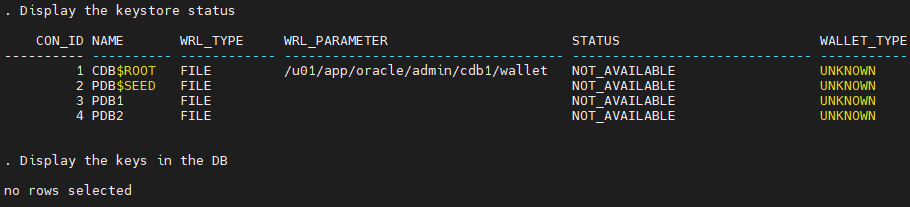

5. **Now, you can perform again this lab from TASK 1** (your database is restored to the point in time prior to enabling TDE)!
</if>

You may now proceed to the next lab!

## **Appendix**: About the Product
### **Overview**

Oracle Key Vault is a full-stack, security-hardened software appliance built to centralize the management of keys and security objects within the enterprise.

Oracle Key Vault is a robust, secure, and standards-compliant key management platform, where you can store, manage, and share your security objects.

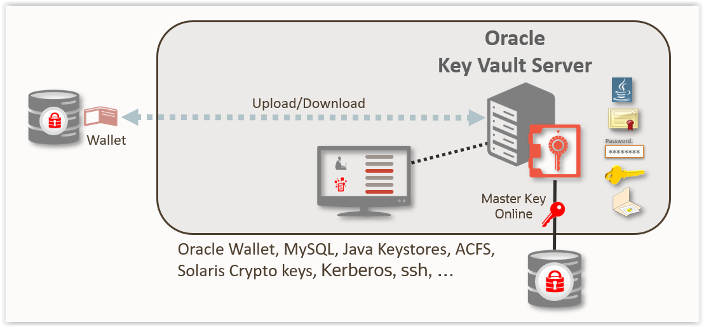

Security objects that you can manage with Oracle Key Vault include as encryption keys, Oracle wallets, Java keystores (JKS), Java Cryptography Extension keystores (JCEKS), and credential files.

Oracle Key Vault centralizes encryption key storage across your organization quickly and efficiently. Built on Oracle Linux, Oracle Database, Oracle Database security features like Oracle Transparent Data Encryption, Oracle Database Vault, Oracle Virtual Private Database, and Oracle GoldenGate technology, Oracle Key Vault's centralized, highly available, and scalable security solution helps to overcome the biggest key-management challenges facing organizations today. With Oracle Key Vault you can retain, back up, and restore your security objects, prevent their accidental loss, and manage their lifecycle in a protected environment.

Oracle Key Vault is optimized for the Oracle Stack (database, middleware, systems), and Advanced Security Transparent Data Encryption (TDE). In addition, it complies with the industry standard OASIS Key Management Interoperability Protocol (KMIP) for compatibility with KMIP-based clients.

You can use Oracle Key Vault to manage a variety of other endpoints, such as MySQL TDE encryption keys.

Starting with Oracle Key Vault release 18.1, a new multi-master cluster mode of operation is available to provide increased availability and support geographic distribution.

The multi-master cluster nodes provide high availability, disaster recovery, load distribution, and geographic distribution to an Oracle Key Vault environment.

An Oracle Key Vault multi-master cluster provides a mechanism to create pairs of Oracle Key Vault nodes for maximum availability and reliability.

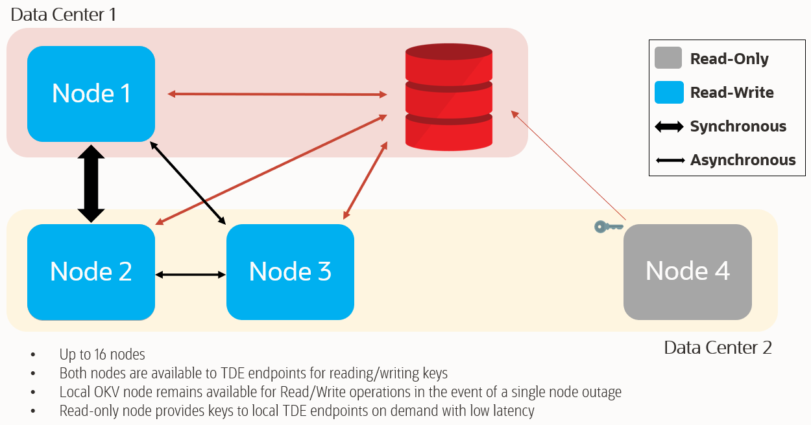

Oracle Key Vault supports two types of mode for cluster nodes: read-only restricted mode or read-write mode.

- **Read-only restricted mode**

  In this mode, only non-critical data can be updated or added to the node. Critical data can be updated or added only through replication in this mode. There are two situations in which a node is in read-only restricted mode:
    - A node is read-only and does not yet have a read-write peer.
    - A node is part of a read-write pair but there has been a breakdown in communication with its read-write peer or if there is a node failure. When one of the two nodes is non-operational, then the remaining node is set to be in the read-only restricted mode. When a read-write node is again able to communicate with its read-write peer, then the node reverts back to read-write mode from read-only restricted mode.

- **Read-write mode**

This mode enables both critical and non-critical information to be written to a node. A read-write node should always operate in the read-write mode.

You can add read-only Oracle Key Vault nodes to the cluster to provide even greater availability to endpoints that need Oracle wallets, encryption keys, Java keystores, certificates, credential files, and other objects.

An Oracle Key Vault multi-master cluster is an interconnected group of Oracle Key Vault nodes. Each node in the cluster is automatically configured to connect with all the other nodes, in a fully connected network. The nodes can be geographically distributed and Oracle Key Vault endpoints interact with any node in the cluster.

This configuration replicates data to all other nodes, reducing risk of data loss. To prevent data loss, you must configure pairs of nodes called read-write pairs to enable bi-directional synchronous replication. This configuration enables an update to one node to be replicated to the other node, and verifies this on the other node, before the update is considered successful. Critical data can only be added or updated within the read-write pairs. All added or updated data is asynchronously replicated to the rest of the cluster.

After you have completed the upgrade process, every node in the Oracle Key Vault cluster must be at Oracle Key Vault release 18.1 or later, and within one release update of all other nodes. Any new Oracle Key Vault server that is to join the cluster must be at the same release level as the cluster.

The clocks on all the nodes of the cluster must be synchronized. Consequently, all nodes of the cluster must have the Network Time Protocol (NTP) settings enabled.

Every node in the cluster can serve endpoints actively and independently while maintaining an identical dataset through continuous replication across the cluster. The smallest possible configuration is a 2-node cluster, and the largest configuration can have up to 16 nodes with several pairs spread across several data centers.

### **Benefits of Using Oracle Key Vault**
- Oracle Key Vault helps you to fight security threats, centralize key storage, and centralize key lifecycle management
- Deploying Oracle Key Vault in your organization will help you accomplish the following:
- Manage the lifecycle for endpoint security objects and keys, which includes key creation, rotation, deactivation, and removal
- Prevent the loss of keys and wallets due to forgotten passwords or accidental deletion
- Share keys securely between authorized endpoints across the organization
- Enroll and provision endpoints easily using a single software package that contains all the necessary binaries, configuration files, and endpoint certificates for mutually authenticated connections between endpoints and Oracle Key Vault
- Work with other Oracle products and features in addition to Transparent Data Encryption (TDE), such as Oracle Real Application Clusters (Oracle RAC), Oracle Data Guard, pluggable databases, and Oracle GoldenGate. Oracle Key Vault facilitates the movement of encrypted data using Oracle Data Pump and transportable tablespaces, a key feature of Oracle Database
- Oracle Key Vault multi-master cluster provides additional benefits, such as:
- Maximum key availability by providing multiple Oracle Key Vault nodes from which data may be retrived
- Zero endpoint downtime during Oracle Key Vault multi-master cluster maintenance

## Want to Learn More?
Technical Documentation:
- [Oracle Key Vault](https://docs.oracle.com/en/database/oracle/key-vault/21.8/index.html)
- [Oracle Key Vault - Multimaster](https://docs.oracle.com/en/database/oracle/key-vault/21.8/okvag/multimaster_concepts.html)
- [Oracle Key Vault - SSH Key Management](https://docs.oracle.com/en/database/oracle/key-vault/21.8/okvag/management_of_ssh_keys_concepts.html)

    > To learn more about how to use OKV to manage SSH keys, please refer to the "[DB Security - Key Vault (SSH Key Management)] (https://livelabs.oracle.com/pls/apex/dbpm/r/livelabs/view-workshop?wid=727)" workshop

Video:
- *Introducing Oracle Key Vault 21 (January 2021)* [](youtube:SfXQEwziyw4)

## Acknowledgements
- **Author** - Hakim Loumi, Database Security PM
- **Contributors** - Peter Wahl, Rahil Mir
- **Last Updated By/Date** - Hakim Loumi, Database Security PM - August 2024

[def]: ../advanced-security/key-vault-exacc/exacc-images/OKV@ExaCC.png "Highlevel Deployment Architecture"